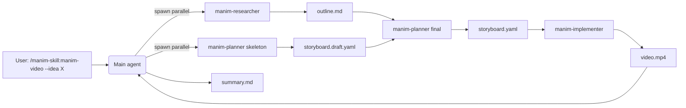
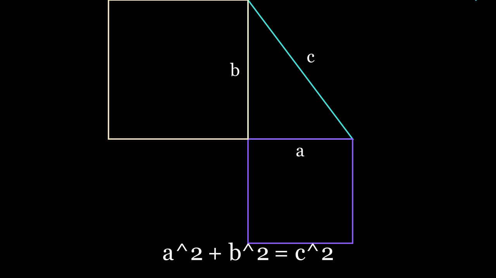
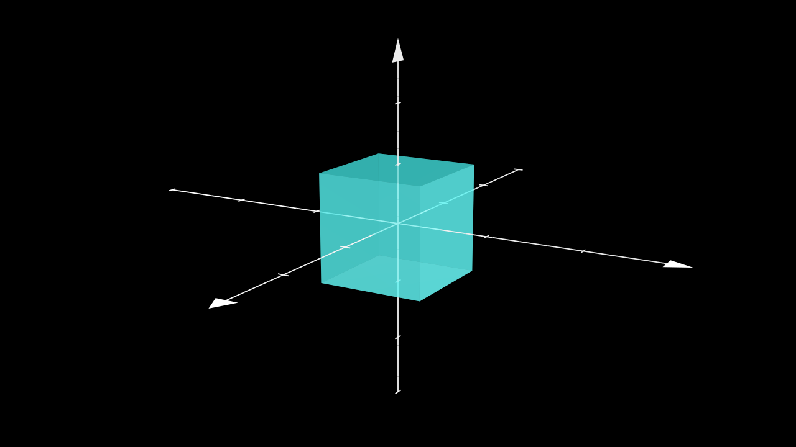
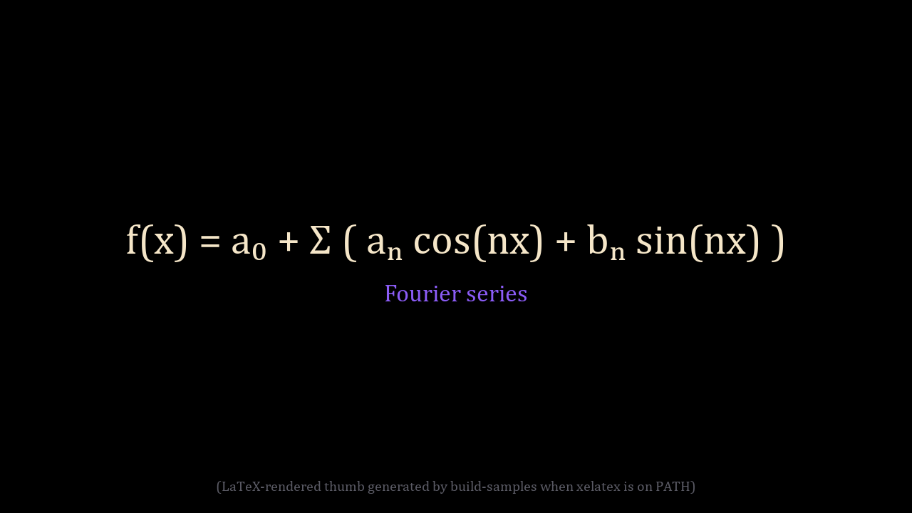
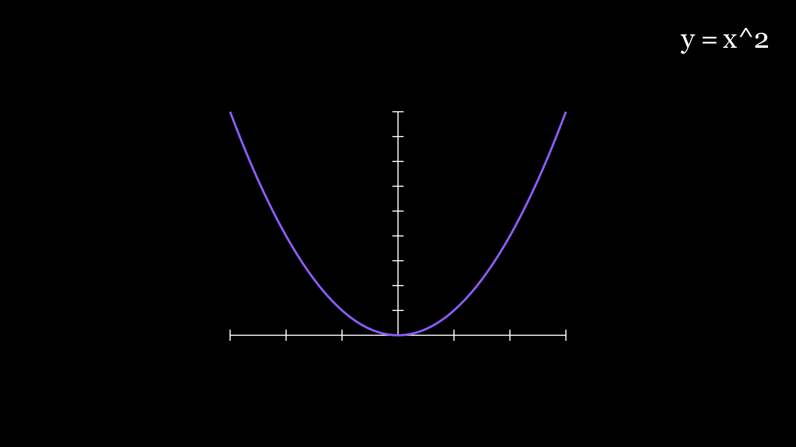
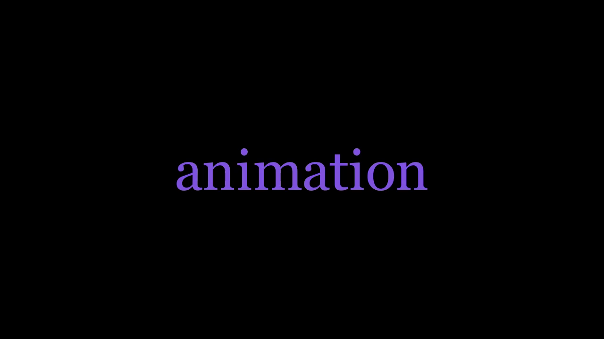
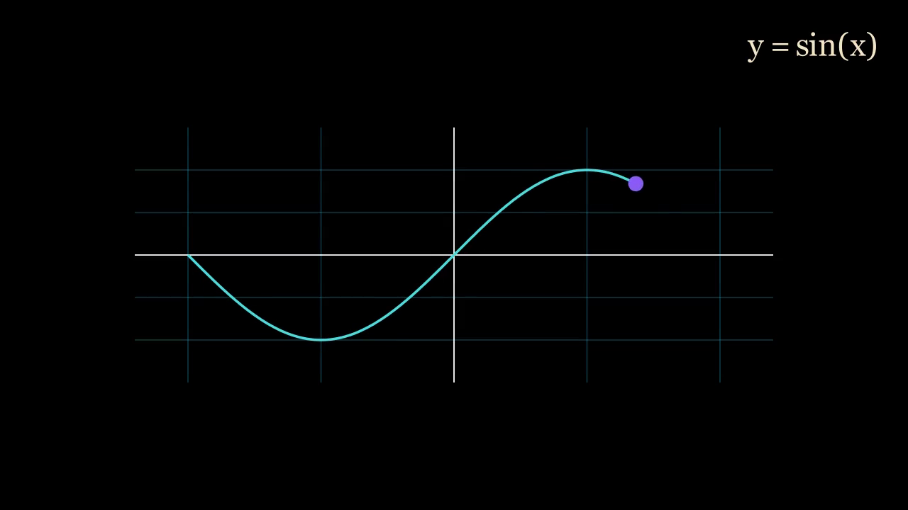

<p align="center">
  
</p>

<h1 align="center">manim-skill</h1>

<p align="center">
  <em>Turn ideas, papers, and math into Manim animations — via a 4-role Claude Code agent pipeline.</em>
</p>

<p align="center">
  
  <br/>
  <sub>Hero GIF is generated by <code>samples/build-samples.ps1</code> after install. Sample 01 ↑.</sub>
</p>

<p align="center">
  
  
  
  
</p>

---

## Table of contents

1. [Overview](#overview)
2. [Prerequisites](#prerequisites)
3. [Installation (Windows / PowerShell)](#installation-windows--powershell)
4. [Verification](#verification)
5. [Usage](#usage)
6. [Flag reference](#flag-reference)
7. [Architecture](#architecture)
8. [Samples](#samples)
9. [Project layout](#project-layout)
10. [Troubleshooting](#troubleshooting)
11. [Other platforms](#other-platforms)
12. [Contributing](#contributing)
13. [License](#license)

---

## Overview

`manim-skill` is a Claude Code plugin that orchestrates a four-role agent pipeline to turn a topic, a research paper, or a math concept into a rendered animation built on [Manim Community](https://github.com/manimCommunity/manim).

| | |
|---|---|
| **Who it is for** | Educators producing explainer videos · researchers visualizing a paper's main result · anyone who would rather describe a video than program one frame at a time |
| **Who it is not for** | Frame-perfect motion-graphics editing · live-action video · 3D modelling pipelines (use [Remotion](https://www.remotion.dev/) or Blender) |
| **Slash command** | `/manim-skill:manim-video` (namespaced — tab-completion in Claude Code surfaces it once installed) |
| **Output** | `out/<run-id>/video.mp4` plus `storyboard.yaml`, per-scene `.py`, narration script, and `summary.md` |

---

## Prerequisites

Required before Step 2 of the install:

| Component | Version | Notes |
|---|---|---|
| **Windows** | 10 / 11 | PowerShell 5.1 or PowerShell 7+ both work |
| **Python** | 3.11+ | `uv` will install it for you if missing |
| **Claude Code** | latest | needed for `/plugin` slash commands |
| **Git** | any recent | needed for marketplace fetch |

Optional but recommended:

| Tool | Why | Install |
|---|---|---|
| **MSVC Build Tools** | Required only if `pycairo` wheel is unavailable for your Python | <https://visualstudio.microsoft.com/downloads/> · workload: *Desktop development with C++* |
| **MiKTeX** | Enables `MathTex` / `Tex`. Without it, math falls back to plain `Text` and renders empty silently | <https://miktex.org/download> |
| **ffmpeg** | Bundled with Manim's wheel on most installs. Verify with `ffmpeg -version` if `--voice` mixing fails | <https://www.gyan.dev/ffmpeg/builds/> |

---

## Installation (Windows / PowerShell)

> The plugin install (Step 1) ships only agent prompts, the slash command, schemas, and scripts. **It does not install Manim or any Python dependency.** Step 2 is mandatory on every new machine — without it, the implementer agent fails with `ModuleNotFoundError: manim` on the first render.

### Step 1 — Install the plugin

Inside Claude Code:

```text
/plugin marketplace add vumichien/manim-skill
/plugin install manim-skill@manim-video-marketplace
```

The plugin lands at:

```
%USERPROFILE%\.claude\plugins\cache\manim-video-marketplace\manim-skill\0.1.0\
```

The venv created in Step 2 will live at `<plugin-root>\.venv\` — next to `install.ps1`, **not** in your project directory.

### Step 2 — Bootstrap the Python venv

Open PowerShell:

```powershell
# Pin the plugin path
$plugin = "$env:USERPROFILE\.claude\plugins\cache\manim-video-marketplace\manim-skill\0.1.0"

# Allow scripts for this session only (skip if execution policy already permits)
Set-ExecutionPolicy -Scope Process -ExecutionPolicy Bypass

# Run the installer
pwsh "$plugin\scripts\install.ps1"
```

What the installer does:

1. Installs **uv** via `astral.sh/uv/install.ps1` if it is not on `PATH`.
2. Creates `.venv\` with Python 3.11 at `<plugin-root>\.venv\`.
3. Installs `manim`, `pycairo`, `numpy`, voiceover deps, and ingest deps from `scripts\requirements.txt`.
4. Probes for `xelatex` and prints a warning if missing.
5. Runs `check-env.py` to verify imports.

If `pycairo` fails, the installer prints two remediation paths (MSVC Build Tools or Conda). See [Troubleshooting](#troubleshooting).

### Step 3 — Activate the venv before launching Claude Code

The implementer agent calls bare `python -m manim`. That `python` must resolve to the plugin's venv, otherwise the system Python (no manim) wins.

```powershell
& "$plugin\.venv\Scripts\Activate.ps1"
claude   # or however you launch Claude Code
```

**Make activation persistent** — add to your `$PROFILE`:

```powershell
$env:MANIM_PLUGIN = "$env:USERPROFILE\.claude\plugins\cache\manim-video-marketplace\manim-skill\0.1.0"
& "$env:MANIM_PLUGIN\.venv\Scripts\Activate.ps1"
```

> After a plugin version bump (`0.1.0` → `0.2.0`), re-run Step 2 against the new versioned folder. The old `.venv` does not auto-migrate.

---

## Verification

Render the six reference samples to confirm the install works end-to-end:

```powershell
pwsh "$plugin\samples\build-samples.ps1"
```

Outputs land at `samples\NN-*\out.mp4`. If sample 01 (Pythagoras) renders, your env is ready.

---

## Usage

```text
/manim-skill:manim-video --idea "Why is the sky blue?"
/manim-skill:manim-video --idea "Why is the sky blue?" --no-voice
/manim-skill:manim-video --paper 1706.03762 --voice openai --quality high
/manim-skill:manim-video --math "Fourier series" --transition-s 1.0
```

Default behavior (since 0.2.0): gtts voiceover + chrome (header bar + title cards) + cross-fade transitions + auto-generated captions. Pass `--no-voice` for the silent + caption-only path; `--no-chrome` for bare scenes.

See [`docs/storyboard-migration-0.2.0.md`](docs/storyboard-migration-0.2.0.md) for the 0.1.x → 0.2.0 migration guide.

---

## Flag reference

```
/manim-skill:manim-video --idea "<topic>" | --paper <id-or-url> | --math "<topic>"
                         [--voice gtts|openai|elevenlabs] [--no-voice]
                         [--no-chrome] [--transition-s 0.7]
                         [--quality low|medium|high|4k] [--storyboard-only] [--out <dir>]
```

| Flag | Argument | Default | Notes |
|---|---|---|---|
| `--idea` | `"<topic>"` | — | Pure topic input. |
| `--paper` | `<arxiv-id\|url\|path>` | — | Auto-detects arXiv id, PDF (local/URL), or HTML. |
| `--math` | `"<topic>"` | — | Math specialization. Uses `MathTex` if LaTeX is present. |
| `--voice` | `gtts\|openai\|elevenlabs` | `gtts` | **Default flipped to gtts in 0.2.0.** Paid providers need env vars. |
| `--no-voice` | (flag) | off | Opt out of TTS. Captions still render. Mutex with `--voice`. |
| `--no-chrome` | (flag) | off | Disable header bar + title cards. Captions still render. |
| `--transition-s` | `<float>` | `0.7` | Cross-fade duration between scenes; range 0.3–1.5. |
| `--quality` | `low\|medium\|high\|4k` | `high` | `high` = 1080p60. |
| `--storyboard-only` | (flag) | off | Stop after planning; skip render. |
| `--out` | `<dir>` | `out/<run-id>/` | Override output directory. |

Full semantics: [`skills/manim-video/references/flag-reference.md`](skills/manim-video/references/flag-reference.md).

---

## Architecture



| Role | Responsibility |
|---|---|
| **Researcher** | Distills source material into an outline of key concepts and visual beats. |
| **Planner** | Runs twice — first as a skeleton (parallel with the researcher), then a final reconciled `storyboard.yaml` that validates against [`schemas/storyboard.schema.json`](schemas/storyboard.schema.json). |
| **Implementer** | Translates the storyboard into Manim Python, runs `scripts/render.py` per scene, and self-repairs render failures within a fixed retry budget. |
| **Main** | Writes `summary.md` with paths, render timings, and any per-scene errors. |

Full orchestration recipe: [`skills/manim-video/SKILL.md`](skills/manim-video/SKILL.md).

---

## Samples

Six reference animations cover the core Manim surface area. Each ships with its `storyboard.yaml`, hand-coded `scene.py`, and (after `build-samples`) a thumbnail + mp4.

| | | |
|---|---|---|
| <a href="samples/01-pythagoras-2d/"><br/><strong>Pythagoras 2D</strong></a><br/><sub>Polygon · Square · LaggedStart</sub> | <a href="samples/02-rotating-cube-3d/"><br/><strong>Rotating cube</strong></a><br/><sub>ThreeDScene · Cube · Rotate</sub> | <a href="samples/03-fourier-math/"><br/><strong>Fourier math</strong></a><br/><sub>MathTex · ReplacementTransform · LaTeX</sub> |
| <a href="samples/04-quadratic-plot/"><br/><strong>Quadratic plot</strong></a><br/><sub>Axes · plot lambda</sub> | <a href="samples/05-text-morph/"><br/><strong>Text morph</strong></a><br/><sub>Text · ReplacementTransform · FadeOut</sub> | <a href="samples/06-sine-wave-tracker/"><br/><strong>Sine wave tracker</strong></a><br/><sub>NumberPlane · ValueTracker · always_redraw</sub> |

Full index: [`samples/README.md`](samples/README.md).

---

## Project layout

```
manim-skill/
├── .claude-plugin/         marketplace.json + plugin.json (publishing manifests)
├── agents/                 manim-researcher.md, manim-planner.md, manim-implementer.md
├── assets/                 logo + hero GIF
├── commands/               /manim-skill:manim-video slash-command entrypoint
├── samples/                6 reference animations (storyboard + scene.py + mp4 + thumb)
├── schemas/                storyboard.schema.json (canonical contract)
├── scripts/                install + ingest + validate + render runners
├── skills/manim-video/     SKILL.md + references/
├── tests/                  pytest suite (validators, render smoke, sample integrity)
├── LICENSE                 Apache-2.0
├── pyproject.toml
└── README.md               (you are here)
```

---

## Troubleshooting

### `pycairo` build fails on Step 2

Two remediation paths. Pick one and re-run Step 2.

**Option A — install MSVC Build Tools:**
1. Download from <https://visualstudio.microsoft.com/downloads/>.
2. Select workload *Desktop development with C++*.
3. Restart PowerShell, re-run `pwsh "$plugin\scripts\install.ps1"`.

**Option B — use Conda (skips native compile entirely):**
```powershell
conda create -n manim python=3.11 -y
conda activate manim
conda install -c conda-forge manim -y
pip install -r "$plugin\scripts\requirements.txt"
```

### `ModuleNotFoundError: manim` when running `/manim-skill:manim-video`

The venv is not activated in the shell that launched Claude Code. Run Step 3 again, or add the activation snippet to your `$PROFILE`.

### `MathTex` renders empty / silent failure

`xelatex` not on `PATH`. Install [MiKTeX](https://miktex.org/download), restart PowerShell, retry. Or omit `--math` and use `--idea`.

### Execution policy blocks `install.ps1`

```powershell
Set-ExecutionPolicy -Scope Process -ExecutionPolicy Bypass
```

This affects the current PowerShell session only — does not change system policy.

### Plugin version bumped, old venv stale

Re-run Step 2 against the new versioned folder. Optionally delete `<old-plugin-root>\.venv\` to free disk.

---

## Other platforms

### Linux / macOS

```bash
# 1. Inside Claude Code
/plugin marketplace add vumichien/manim-skill
/plugin install manim-skill@manim-video-marketplace

# 2. Bootstrap the venv
PLUGIN="$HOME/.claude/plugins/cache/manim-video-marketplace/manim-skill/0.1.0"
bash "$PLUGIN/scripts/install.sh"

# 3. Activate
source "$PLUGIN/.venv/bin/activate"

# 4. Make a video
/manim-skill:manim-video --idea "Why is the sky blue?"
```

### Developing on a clone (not via marketplace)

```powershell
pwsh scripts\install.ps1                # Windows
& .venv\Scripts\Activate.ps1
```

```bash
bash scripts/install.sh                 # Linux / macOS
source .venv/bin/activate
```

The venv lands at `<repo-root>\.venv\` instead of the plugin cache.

---

## Contributing

PRs welcome. Quick conventions:

- Python ≥3.11. Run `ruff check .` + `pytest` before pushing (CI enforces both).
- Kebab-case for executable scripts (`scripts/render.py`), snake_case for importable modules (`scripts/ingest_shared.py`).
- New samples go under `samples/NN-<slug>/`: write `storyboard.yaml` first (validate with `python scripts/validate-storyboard.py`), then a hand-coded `scene.py`, then add the entry to `samples/build-samples.{ps1,sh}`.
- [Conventional Commits](https://www.conventionalcommits.org/). No AI references in commit messages.

---

## License

Apache-2.0. See [`LICENSE`](LICENSE).
