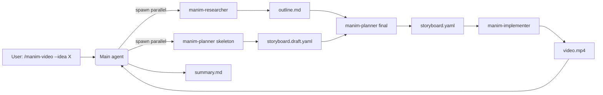

<p align="center">
  
</p>

<h1 align="center">manim-skill</h1>

<p align="center">
  <em>Turn ideas, papers, and math into Manim animations — via a 4-role Claude Code agent pipeline.</em>
</p>

<p align="center">
  
  <br/>
  <sub>Hero GIF is generated by <code>samples/build-samples.ps1</code> after install. Sample 01 ↑.</sub>
</p>

<p align="center">
  
  
  
  
</p>

---

## What it does

`manim-skill` is a Claude Code plugin that orchestrates a four-role agent pipeline to turn a topic, a research paper, or a math concept into a rendered animation built on [Manim Community](https://github.com/manimCommunity/manim).

**Who it is for.** Educators producing explainer videos, researchers visualizing a paper's main result, anyone who would rather describe a video than program one frame at a time.

**Who it is not for.** Frame-perfect motion-graphics editing, live-action video, or 3D modelling pipelines. Use [Remotion](https://www.remotion.dev/) or Blender for those.

## Quick start

```bash
# 1. Add the marketplace and install the plugin (inside Claude Code)
/plugin marketplace add vumichien/manim-skill
/plugin install manim-skill@manim-video-marketplace

# 2. Bootstrap the Python venv (Windows)
pwsh scripts/install.ps1

# 2. ...or Linux / macOS
bash scripts/install.sh

# 3. Render a sample to verify your install
pwsh samples/build-samples.ps1   # or: bash samples/build-samples.sh

# 4. Make a video
/manim-video --idea "Why is the sky blue?"
```

> First-time install on Windows may need [MSVC Build Tools](https://visualstudio.microsoft.com/downloads/) for `pycairo`. The installer detects this and prints exact remediation steps.
> [LaTeX](https://miktex.org/) is optional — without it, `MathTex` falls back to plain `Text`.

## Samples

Six reference animations cover the core Manim surface area. Each ships with its `storyboard.yaml`, hand-coded `scene.py`, and (after `build-samples`) a thumbnail + mp4.

| | | |
|---|---|---|
| <a href="samples/01-pythagoras-2d/"><br/><strong>Pythagoras 2D</strong></a><br/><sub>Polygon · Square · LaggedStart</sub> | <a href="samples/02-rotating-cube-3d/"><br/><strong>Rotating cube</strong></a><br/><sub>ThreeDScene · Cube · Rotate</sub> | <a href="samples/03-fourier-math/"><br/><strong>Fourier math</strong></a><br/><sub>MathTex · ReplacementTransform · LaTeX</sub> |
| <a href="samples/04-quadratic-plot/"><br/><strong>Quadratic plot</strong></a><br/><sub>Axes · plot lambda</sub> | <a href="samples/05-text-morph/"><br/><strong>Text morph</strong></a><br/><sub>Text · ReplacementTransform · FadeOut</sub> | <a href="samples/06-sine-wave-tracker/"><br/><strong>Sine wave tracker</strong></a><br/><sub>NumberPlane · ValueTracker · always_redraw</sub> |

See [`samples/README.md`](samples/README.md) for the full index.

## Flags

```
/manim-video <one-mode-flag> [optional flags]
```

| Flag | Argument | Default | Notes |
|---|---|---|---|
| `--idea` | `"<topic>"` | — | Pure topic input. |
| `--paper` | `<arxiv-id\|url\|path>` | — | Auto-detects arXiv id, PDF (local/URL), or HTML. |
| `--math` | `"<topic>"` | — | Math specialization. Uses `MathTex` if LaTeX is present. |
| `--voice` | `gtts\|openai\|elevenlabs` | none | `gtts` is keyless. Paid providers need env vars. |
| `--quality` | `low\|medium\|high\|4k` | `high` | `high` = 1080p60. |
| `--storyboard-only` | (flag) | off | Stop after planning; skip render. |
| `--out` | `<dir>` | `out/<run-id>/` | Override output directory. |

Full semantics in [`skills/manim-video/references/flag-reference.md`](skills/manim-video/references/flag-reference.md).

## How it works



- **Researcher** distills source material into an outline of key concepts and visual beats.
- **Planner** runs twice — first as a skeleton (parallel with the researcher), then a final reconciled `storyboard.yaml` that validates against [`schemas/storyboard.schema.json`](schemas/storyboard.schema.json).
- **Implementer** translates the storyboard into Manim Python, runs `scripts/render.py` per scene, and self-repairs render failures within a fixed retry budget.
- **Main** writes `summary.md` with paths, render timings, and any per-scene errors.

Read [`skills/manim-video/SKILL.md`](skills/manim-video/SKILL.md) for the full orchestration recipe.

## Project layout

```
manim-skill/
├── .claude-plugin/         marketplace.json + plugin.json (publishing manifests)
├── agents/                 manim-researcher.md, manim-planner.md, manim-implementer.md
├── assets/                 logo + hero GIF
├── commands/               /manim-video slash-command entrypoint
├── samples/                6 reference animations (storyboard + scene.py + mp4 + thumb)
├── schemas/                storyboard.schema.json (canonical contract)
├── scripts/                install + ingest + validate + render runners
├── skills/manim-video/     SKILL.md + references/
├── tests/                  pytest suite (validators, render smoke, sample integrity)
├── LICENSE                 Apache-2.0
├── pyproject.toml
└── README.md               (you are here)
```

## Contributing

PRs welcome. Quick conventions:

- Python ≥3.11. Run `ruff check .` + `pytest` before pushing (CI enforces both).
- Kebab-case for executable scripts (`scripts/render.py`), snake_case for importable modules (`scripts/ingest_shared.py`).
- New samples go under `samples/NN-<slug>/`: write `storyboard.yaml` first (validate with `python scripts/validate-storyboard.py`), then a hand-coded `scene.py`, then add the entry to `samples/build-samples.{ps1,sh}`.
- [Conventional Commits](https://www.conventionalcommits.org/). No AI references in commit messages.

## License

Apache-2.0. See [`LICENSE`](LICENSE).
